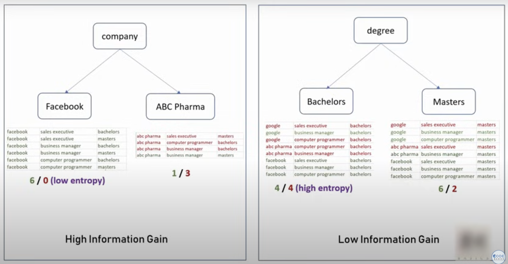

### Decision Trees

1. We can't create a decision boundary where the data from both the classes (here we're taking 2 classes) is scattered among around each other.

2. Hence if we implement the algorithms like logistic regression, support vector machine (linear) don't work on such kind of data and we have to create multiple decision boundaries which is not right.

3. Here decision tree comes to rescue. In the decision tree algorithm the model selects each feature in the dataset, classifies the values present in it an check the probability of each values of being a success or not.

4. To explain with an example, suppose there's a dataset of employees and we have to determine which employees salary would be greater than $100k. So there are multiple features in the dataset company name (let's take google, facebook, tesla), designation (let's take business manager, software engineer, sales executive), degree (let's take bachelors & masters).

5. Now the algorithm will take the `company_name` feature first and check which company has more probability of paying $100k to its employees. Suppose facebook is paying more than 100k to all of its employees then the algorithm determines in this level that if an employee is from facebook then they are sure to have salary more than 100k `(1)`. For remaining two companies it's still unsure.

6. Then the algorithm moves on the next level to check the second feature which is `designation`, now it checks employees with which designation have more probability of receiving more than 100k. Suppose in Google, the employees in business manager designation are all receiving 100k while the employees in sales executive designation are not receiving 100k at all, then the model determines here itself that Google Business Manager's receive more than 100k `(1)` and Google's Sales Executive don't receive 100k at all `(0)`. For the software engineer's at Google we're still unsure the model goes on next level and same for the employees in Tesla.

7. Now on the next level the model checks for the `degree` feature, that which degree holder employee has more probability of receiving more than 100k. Suppose a SWE at Google having master's degree surely receives more than 100k `(1)` while one with bachelors degree doesn't receive 100k `(0)` the model will determine it here itself and won't go to next level.

8. This is how in the iteration of features the decision tree works to determine the classes of data points.

**_How is the Order of Features determined?_**

1. The model determines which feature to take first or basically the order of the features on basis of calculating the entropy.

2. Entropy basically means the degree of randomness present for each feature. In other words how highly one class dominates the other class for a particular feature. So if we take `company_name` feature then in its values for Facebook the class `having more than 100k` is more than `having less than 100k`, same for Tesla. While if we take the `Degree` feature the class distribution is quite random around 50/50 then the model won't select this feature first.

3. Basically lesser the entropy of a feature, higher the priority to that feature is given.
