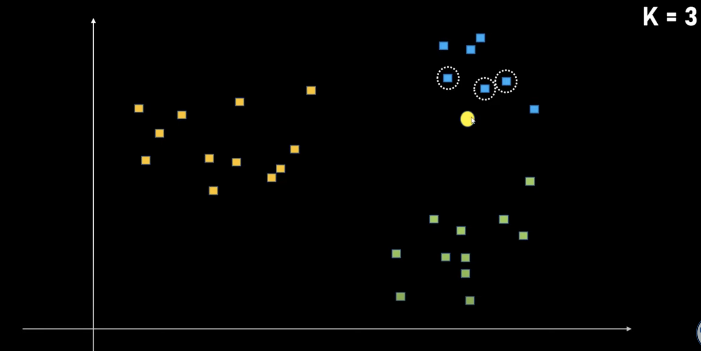

### K Nearest Neighbours

1. K Nearest Neighbours algorithm is a classification algorithm that takes the `K` nearest points to the new data point and based on them the class of this new data point is determined.

2. So suppose we're provided with a dataset containing 3 classes of cars: XUV, Sedan and Hatchback and all the present datapoints are present in their classes making a cluster of their class something like the image below.
   

3. So now when a new point is plotted on the graph and we have to determine the class for this new point. For this we follow the following steps:
   - First we determine the number of neighbours (`K`) that will contribute in determining the class of this new datapoint. Suppose for now `K = 3`.
   - Now for this new datapoint we'll find the nearest K neighbour datapoints, which are 3 in this case. So we'll find the 3 nearest neighbours to this new datapoint.
   - The distance from this new datapoint to the other datapoints is usually measured using the methods like **Euclidean Distance**.
   - Once the 3 nearest points are found we'll then check the classes of those points and the majority of the class that occurs in these neighbours is determined as the class of this new data point. So suppose the nearest 3 points have classes as follows XUV, Sedan and XUV respectively. Since XUV has a majority over here it will be the class of this new datapoint.
   - In the cases where number of classes is equal to the number of `K` (nearest neighbours) and we receive the nearest points consisting of every class. In that case the point which is nearest to the new datapoint determines the class of this new datapoint. So suppose the 3 nearest neigbours had classes XUV, Sedan and Hatchback then the new datapoint takes the class of the data point which is nearest to it.
